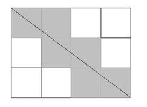
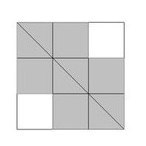

# Count Black Cells
Imagine a white rectangular grid of `n` rows and `m` columns divided into two parts by a diagonal line running from the upper left to the lower right corner. Now let's paint the grid in two colors according to the following rules:

*   A cell is painted black if it has at least one point in common with the diagonal;
*   Otherwise, a cell is painted white.

Count the number of cells painted black.

**Example**

*   For `n = 3` and `m = 4`, the output should be
    `countBlackCells(n, m) = 6`.

    There are `6` cells that have at least one common point with the diagonal and therefore are painted black.

    

*   For `n = 3` and `m = 3`, the output should be
    `countBlackCells(n, m) = 7`.

    `7` cells have at least one common point with the diagonal and are painted black.

    

**Input/Output**

*   **[time limit] 4000ms (js)**

*   **[input] integer n**

    The number of rows.

    _Guaranteed constraints:_
    `1 ≤ n ≤ 10<sup>5</sup>`.

*   **[input] integer m**

    The number of columns.

    _Guaranteed constraints:_
    `1 ≤ m ≤ 10<sup>5</sup>`.

*   **[output] integer**

    The number of black cells.


## My Solution
```javascript
function countBlackCells(n, m) {
    
    var GCF = function(a, b) {
        if (b == 0) return a;
        return GCF(b, Math.floor(a % b));
    }
    
    var temp = Math.min(n, m);
    m = Math.max(n, m);
    n = temp;
    
    var counter = m - n + 1;
    
    if (m % n == 0) {
        counter += (m / (m / n)) - 1;
    } else {
        var lcm = Math.floor(m / GCF(m, n));
        if ( lcm != 1 ) {
            counter += Math.floor(m / lcm) - 1;
        }
    }
    
    return counter;
}
​
```
