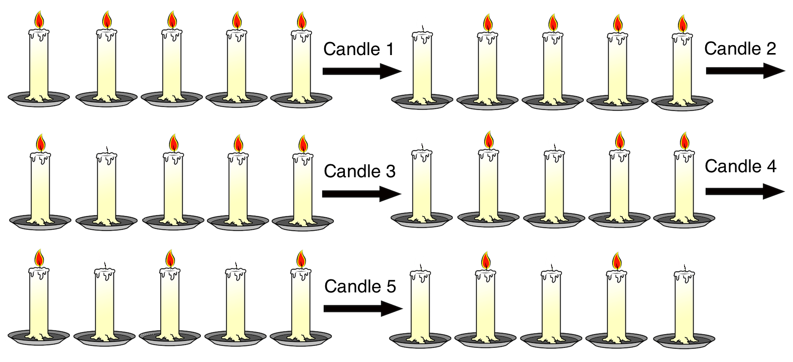

# Switch Lights
`N` candles are placed in a row, some of them are initially lit. For each candle from the `1st` to the `Nth` the following algorithm is applied: if the observed candle is lit then states of this candle and all candles before it are changed to the opposite. Which candles will remain lit after applying the algorithm to all candles in the order they are placed in the line?

**Example**

*   For `a = [1, 1, 1, 1, 1]`, the output should be
    `switchLights(a) = [0, 1, 0, 1, 0]`.

    Check out the image below for better understanding:

    

*   For `a = [0, 0]`, the output should be
    `switchLights(a) = [0, 0]`.

    The candles are not initially lit, so their states are not altered by the algorithm.

**Input/Output**

*   **[time limit] 4000ms (js)**

*   **[input] array.integer a**

    Initial situation - array of zeros and ones of length `N`, `1` means that the corresponding candle is lit.

    _Guaranteed constraints:_
    `2 ≤ a.length ≤ 5000`.

*   **[output] array.integer**

    Situation after applying the algorithm - array in the same format as input with the same length.


## My Solution
```javascript
function switchLights(a) {
        for (var i = 0; i < a.length; i++) {
                if (a[i] == 1) switchAllUpTo(a, i);
        }
        return a;
}
​
function switchAllUpTo(arr, x) {
        for (var i = 0; i <= x; i++) {
                arr[i] = switchSingle(arr[i]);
        }
}
​
function switchSingle(x) {
        return (x == 1) ? 0 : 1;
}
```
