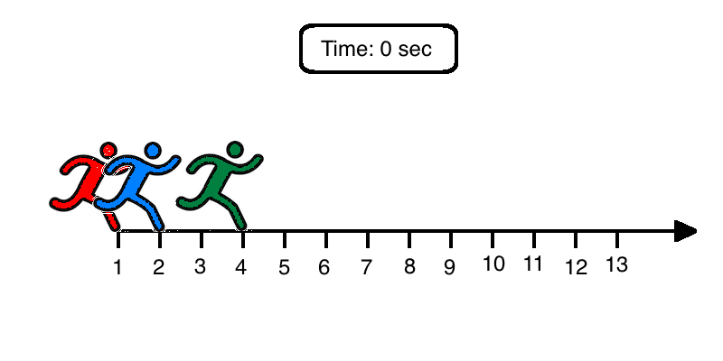

# Runners Meetings
Some people run along a straight line in the same direction. They start simultaneously at pairwise distinct positions and run with constant speed (which may differ from person to person).

If two or more people are at the same point at some moment we call that a meeting. The number of people gathered at the same point is called meeting cardinality.

For the given starting positions and speeds of runners find the maximum meeting cardinality assuming that people run infinitely long. If there will be no meetings, return `-1` instead.

**Example**

For `startPosition = [1, 4, 2]` and `speed = [27, 18, 24]`, the output should be
`runnersMeetings(startPosition, speed) = 3`.

In 20 seconds after the runners start running, they end up at the same point. Check out the gif below for better understanding:



**Input/Output**

*   **[time limit] 4000ms (js)**

*   **[input] array.integer startPosition**

    A non-empty array of integers representing starting positions of runners (in meters).

    _Guaranteed constraints:_
    `2 ≤ startPosition.length ≤ 10`,
    `-1000 ≤ startPosition[i] ≤ 1000`.

*   **[input] array.integer speed**

    Array of positive integers of the same length as `startPosition` representing speeds of the runners (in meters per minute).

    _Guaranteed constraints:_
    `speed.length = startPosition.length`,
    `1 ≤ speed[i] ≤ 30`.

*   **[output] integer**

    The maximum meeting cardinality or `-1` if there will be no meetings.


## My Solution
```javascript
function runnersMeetings(startPosition, speed) {
    function groupAndReturnMax(arr) {
        var max = -2; // -2 because we'll add one at the end
        var maxItem = "";
        var obj = {};
        for (var i in arr) {
            if (!obj[arr[i]]) obj[arr[i]] = 0;
            obj[arr[i]]++;
            if (obj[arr[i]] > max) {
                max = obj[arr[i]];
                maxItem = arr[i];
            }
        }
        return max;
    }
    
    function calcIntersect(v1, x1, v2, x2) {
        return (x2 - x1) / (v1 - v2);
    }
    
    var max = -2; // -2 because we'll add one at the end
    
    for (var i = 0; i < startPosition.length; i++) {
        var intersectionTimes = [];
        for (var j = 0; j < startPosition.length; j++) {
            if (i == j) continue;
            var intersectionTime = calcIntersect(speed[i], startPosition[i], speed[j], startPosition[j]);
            if (intersectionTime >= 0 && isFinite(intersectionTime)) {
                intersectionTimes.push(intersectionTime);
            }
        }
        max = Math.max(max, groupAndReturnMax(intersectionTimes));
    }
    
    return max + 1;
}
​
```
