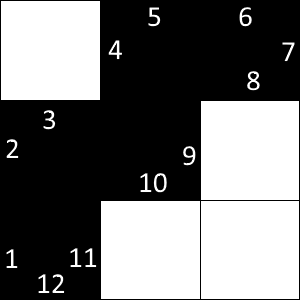
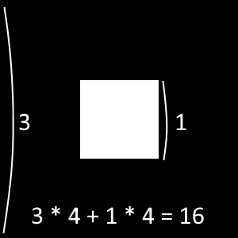

# Polygon Perimeter
You have a rectangular white board with some black cells. The black cells create a connected black figure, i.e. it is possible to get from any black cell to any other one through connected adjacent (sharing a common side) black cells.

Find the perimeter of the black figure assuming that a single cell has unit length.

It's guaranteed that there is at least one black cell on the table.

**Example**

*   For

    ```
    matrix = [[false, true,  true ],
              [true,  true,  false],
              [true,  false, false]]

    ```

    the output should be
    `polygonPerimeter(matrix) = 12`.

    

*   For

    ```
    matrix = [[true, true,  true],
              [true, false, true],
              [true, true,  true]]

    ```

    the output should be
    `polygonPerimeter(matrix) = 16`.

    

**Input/Output**

*   **[time limit] 4000ms (js)**

*   **[input] array.array.boolean matrix**

    A matrix of booleans representing the rectangular board where `true` means a _black_ cell and `false` means a _white_ one.

    _Guaranteed constraints:_
    `2 ≤ matrix.length ≤ 5`,
    `2 ≤ matrix[0].length ≤ 5`.

*   **[output] integer**


## My Solution
```javascript
function polygonPerimeter(matrix) {
    // return the number of true items above, below, left and right an index
    function neighbors(row, col, arr) {
        var count = 0;
        for (var i = -1; i <= 1; i = i + 2) {
            if (row + i >= 0 && row + i < arr.length) {
                count += ((arr[row + i][col]) ? 1 : 0);
            }
        }
        for (var j = -1; j <= 1; j = j + 2) {
            if (col + j >= 0 && col + j < arr[row].length) {
                count += ((arr[row][col + j]) ? 1 : 0);
            }
        }
        return count;
    }
    
    function getSum(total, num) {
        return total + num;
    }
    
    return matrix.map(function (row, y, arr) {
        return row.map(function(val, x) {
            // if (val) console.log(y, x);
            return (val) ? 4 - neighbors(y, x, matrix) : 0;
        }).reduce(getSum);
    }).reduce(getSum);
}
​
```
