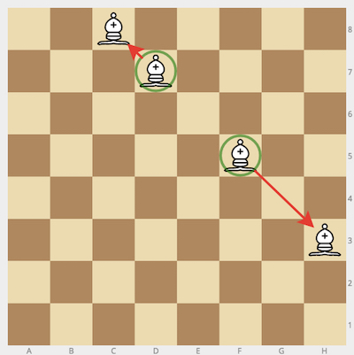
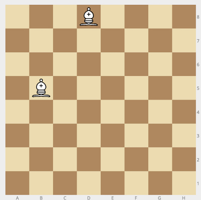

In the Land Of Chess, bishops don't really like each other. In fact, when two bishops happen to stand on the _same diagonal_, they immediately rush towards the opposite ends of that same diagonal.

Given the initial positions (in chess notation) of two bishops, `bishop1` and `bishop2`, calculate their future positions. Keep in mind that bishops won't move unless they see each other along the same diagonal.

**Example**

*   For `bishop1 = "d7"` and `bishop2 = "f5"`, the output should be
    `bishopDiagonal(bishop1, bishop2) = ["c8", "h3"]`.

    

*   For `bishop1 = "d8"` and `bishop2 = "b5"`, the output should be
    `bishopDiagonal(bishop1, bishop2) = ["b5", "d8"]`.

    The bishops don't belong to the same diagonal, so they don't move.
    

**Input/Output**

*   **[time limit] 4000ms (js)**

*   **[input] string bishop1**

    Coordinates of the first bishop in [chess notation](keyword://chess-notation).

*   **[input] string bishop2**

    Coordinates of the second bishop in the same notation.

*   **[output] array.string**

    Coordinates of the bishops in [lexicographical order](keyword://lexicographical-order-for-strings) after they check the diagonals they stand on.