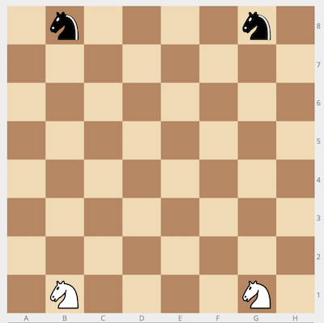

# Whose Turn
Imagine a standard chess board with only two white and two black knights placed in their standard starting positions: the white knights on `b1` and `g1`; the black knights on `b8` and `g8`.



There are two players: one plays for white, the other for black. During each move, the player picks one of his knights and moves it to an unoccupied square according to standard chess rules. Thus, a knight on `d5` can move to any of the following squares: `b6`, `c7`, `e7`, `f6`, `f4`, `e3`, `c3`, and `b4`, as long as it is not occupied by either a friendly or an enemy knight.


The players take turns in making moves, starting with the white player. Given the configuration `p` of the knights after an unspecified number of moves, determine whose turn it is.

**Example**

For `p = "b1;g1;b8;g8"`, the output should be
`whoseTurn(p) = true`.

The configuration corresponds to the initial state of the game. Thus, it's white's turn.

**Input/Output**

*   **[time limit] 4000ms (js)**

*   **[input] string p**

    The positions of the four knights, starting with white knights, separated by a semicolon, in the [chess notation](keyword://chess-notation).

*   **[output] boolean**

    `true` if white is to move, `false` otherwise.


## My Solution
```javascript
    var possibleMoves = [
        [2, 1],
        [2, -1],
        [-2, 1],
        [-2, -1],
        [1, 2],
        [1, -2],
        [-1, 2],
        [-1, -2]
    ];
    var startingPos = [
        toPos('b1'),
        toPos('g1'),
        toPos('b8'),
        toPos('g8')
    ];
    var currentPos = p.split(";").map(n => toPos(n));
    var totalMoves = 0;
    for (var i in startingPos) {
        var desired = currentPos[i];
        var pos = startingPos[i];
        var moves = 0;
        var spots = [pos];
        while (spots.findIndex(function(val) {
            return val.x == desired.x && val.y == desired.y
        }) == -1) {
            moves++;
            for (var j = spots.length - 1; j >= 0; j--) {
                for (var k in possibleMoves) {
                    var next = {
                        x: spots[j].x + possibleMoves[k][0],
                        y: spots[j].y + possibleMoves[k][1]
                    }
                    if (validPos(next)) {
                        spots.push(next);
                    }
                }
            }
        }
        totalMoves += moves;
    }
    return totalMoves % 2 == 0;
}
​
```
