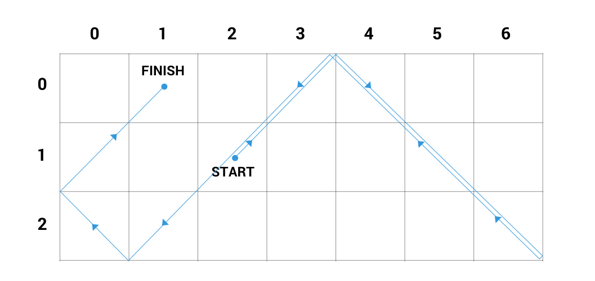

# Chess Bishop Dream
In _ChessLand_ there is a small but proud chess bishop with a recurring dream. In the dream the bishop finds itself on an `n × m` chessboard with mirrors along each edge, and it is not a bishop but a ray of light. This ray of light moves only along diagonals (the bishop can't imagine any other types of moves even in its dreams), it never stops, and once it reaches an edge or a corner of the chessboard it reflects from it and moves on.

Given the initial position and the direction of the ray, find its position after `k` steps where a step means either moving from one cell to the neighboring one or reflecting from a corner of the board.

**Example**

For `boardSize = [3, 7]`, `initPosition = [1, 2]`,

`initDirection = [-1, 1]` and `k = 13`, the output should be

`chessBishopDream(boardSize, initPosition, initDirection, k) = [0, 1]`.

Here is the bishop's path:

```
[1, 2] -> [0, 3] -(reflection from the top edge)-> [0, 4] -> 
[1, 5] -> [2, 6] -(reflection from the bottom right corner)-> [2, 6] ->
[1, 5] -> [0, 4] -(reflection from the top edge)-> [0, 3] ->
[1, 2] -> [2, 1] -(reflection from the bottom edge)-> [2, 0] -(reflection from the left edge)->
[1, 0] -> [0, 1]

```



**Input/Output**

*   **[time limit] 4000ms (js)**

*   **[input] array.integer boardSize**

    An array of two integers, the number of rows and columns, respectively. Rows are numbered by integers from `0` to `boardSize[0] - 1`, columns are numbered by integers from `0` to `boardSize[1] - 1` (both inclusive).

    _Guaranteed constraints:_

    `1 ≤ boardSize[i] ≤ 20`.

*   **[input] array.integer initPosition**

    An array of two integers, indices of the row and the column where the bishop initially stands, respectively.

    _Guaranteed constraints:_

    `0 ≤ initPosition[i] < boardSize[i]`.

*   **[input] array.integer initDirection**

    An array of two integers representing the initial direction of the bishop. If it stands in `(a, b)`, the next cell he'll move to is `(a + initDirection[0], b + initDirection[1])` or whichever it'll reflect to in case it runs into a mirror immediately.

    _Guaranteed constraints:_

    `initDirection[i] ∈ {-1, 1}`.

*   **[input] integer k**

    _Guaranteed constraints:_

    `1 ≤ k ≤ 10<sup>9</sup>`.

*   **[output] array.integer**

    The position of the bishop after `k` steps.


## My Solution
```javascript
function chessBishopDream(size, pos, dir, k) {
    var hist = [];
    for (var i = 0; i < k; i++) {
        hist.push({pos:[pos[0], pos[1]], dir:[dir[0], dir[1]]});
        pos[0] += dir[0];
        pos[1] += dir[1];
        if (pos[0] < 0 || pos[0] >= size[0]) {
            dir[0] *= -1;
            pos[0] += dir[0];
        }
        if (pos[1] < 0 || pos[1] >= size[1]) {
            dir[1] *= -1;
            pos[1] += dir[1];
        }
        if (hist[0].pos[0] == pos[0] &&
           hist[0].pos[1] == pos[1] &&
           hist[0].dir[0] == dir[0] &&
           hist[0].dir[1] == dir[1]) {
            // We have already been in this position, going the same direction. We are in a cycle.
            return hist[(k - 1 - i) % hist.length].pos;
        }
    }
    return pos;
}
​
```
