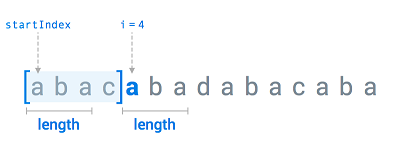
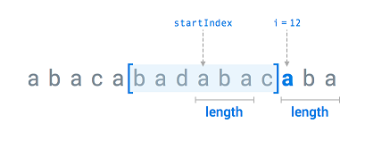

In its effort to push the limits of file compression, Dropbox recently developed a lossless compression algorithm for H.264 and JPEG files. Since you are thinking about applying for a job at Dropbox, you decided to experiment with simple lossless compression as part of your interview prep.

One of the most widely known approaches in the field of compression algorithms is _sliding window compression_. It works as follows:

*   Consider characters one by one. Let the current character index be `i`.
*   Take the last `width` characters before the current one (i.e. `s[i - width, i - 1]`, where `s[i, j]` means the [substring](keyword://substring) of `s` from index `i` to index `j`, both inclusive), and call it _the window_.
*   Find such `startIndex` and `length` that `s[i, i + length - 1] = s[startIndex, startIndex + length - 1]` and `s[startIndex, startIndex + length - 1]` is contained within _the window_. If there are several such pairs, choose the one with the largest `length`. If there still remains more than one option, choose the one with the smallest `startIndex`.
*   If the search was successful, append `"(startIndex,length)"` to the result and move to the index `i + length`.
*   Otherwise, append the current character to the result and move on to the next one.

Given a string, apply _sliding window compression_ to it.

**Example**

*   For `inputString = "abacabadabacaba"` and `width = 7`, the output should be
    `losslessDataCompression(inputString, width) = "ab(0,1)c(0,3)d(4,3)c(8,3)"`.

    *   Step 1: `i = 0, inputString[i] = 'a', window = ""`. `'a'` is not contained within _the window_, so it is appended to the result.
    *   Step 2: `i = 1, inputString[i] = 'b', window = "a"`. `'b'` is not contained within _the window_, so it is appended to the result.
    *   Step 3: `i = 2, inputString[i] = 'a', window = "ab"`. `'a'` can be found in _the window_. `'a'` in _the window_ corresponds to the `inputString[0]`, so `(0,1)` representing the _substring_ `"a"` is appended to the result.
    *   Step 4: `i = 3, inputString[i] = 'c', window = "aba"`. The same situation as in the first two steps.
    *   Step 5: `i = 4, inputString[i] = 'a', window = "abac"`. Consider `startIndex = 0, length = 3`. `inputString[startIndex, startIndex + length - 1] = "aba"` and it is contained within _the window_, `inputString[i, i + length - 1] = "aba"`. Therefore, `"(0,3)"` should be added to the result. `i += length`.
        
    *   Step 6: `i = 7, inputString[i] = 'd', window = inputString[0, 6] = "abacaba"`. The same situation as in the first two steps.
    *   Step 7: `i = 8, inputString[i] = 'a', window = inputString[1, 7] = "bacabad"`. Consider `length = 3` again. `inputString[i, i + b - 1] = "aba"`, `window[3, 5] = "aba"`, and it corresponds to `inputString[4, 6]` since `inputString[0, 2]` is no longer within _the window_. So, `"(4,3)"` should be appended. `i += length`.
    *   Step 8: `i = 11, inputString[i] = 'c', window = "abadaba"`. The same situation as at the first two steps.
    *   Step 9: `i = 12, inputString[i] = 'a', window = "badabac"`. `length = 3, inputString[i, i + length - 1] = "aba"`, `window[3, 5] = "aba"`, and it corresponds to `inputString[8, 10]`. So, `"(8,3)"` should be appended. `i += length`.

    

*   For `inputString = "abacabadabacaba"` and `width = 8`, the output should be
    `losslessDataCompression(inputString, width) = "ab(0,1)c(0,3)d(0,7)"`.

    In both of the above examples the resulting "compressed" string becomes even longer than the initial one. In fact, _sliding window compression_ proves to be efficient for longer inputs.

*   For `inputString = "aaaaaaaaaaaaaaaaaaaaaaaaaaaa"` and `width = 12`, the output should be
    `losslessDataCompression(inputString, width) = "a(0,1)(0,2)(0,4)(0,8)(4,12)"`.

    In the last example the resulting string is one character shorter than the input one. It is the shortest possible example of the efficient work of _sliding window compression_. If the input contained even more letters `'a'`, then the effect of this approach would be even more considerable.

**Input/Output**

*   **[time limit] 4000ms (js)**

*   **[input] string inputString**

    A non-empty string of lowercase letters.

    _Guaranteed constraints:_
    `1 ≤ inputString.length ≤ 40`.

*   **[input] integer width**

    A positive integer.

    _Guaranteed constraints:_
    `1 ≤ width ≤ 108`.

*   **[output] string**

    Compressed `inputString`.