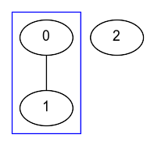
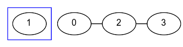

# bfsComponentSize
Given the [adjacency matrix](keyword://adjacency-matrix-unweighted) of an _undirected_ graph with _no loops or multiple edges_, find the size of the [connected component](keyword://connected-component) of vertex `1` (0-based).

**Example**

*   For

    ```
    matrix = [[false, true, false],
              [true, false, false],
              [false, false, false]]

    ```

    the output should be
    `bfsComponentSize(matrix) = 2`.

    The component contains vertices `0` and `1`.

    

*   For

    ```
    matrix = [[false, false, true, false],
              [false, false, false, false],
              [true, false, false, true],
              [false, false, true, false]]

    ```

    the output should be
    `bfsComponentSize(matrix) = 1`.

    The component consists of a single vertex `1`.

    

**Input/Output**

*   **[time limit] 4000ms (js)**

*   **[input] array.array.boolean matrix**

    _Adjacency matrix_ of the given graph.

    _Guaranteed constraints:_
    `3 ≤ matrix.length ≤ 10`,
    `matrix[i].length = matrix.length`.

*   **[output] integer**


## My Solution
```javascript
function bfsComponentSize(matrix) {
​
  var visited = [];
  var queue = [];
  var componentSize = 0;
​
  for (var i = 0; i < matrix.length; i++) {
    visited.push(false);
  }
​
  visited[1] = true;
  queue.push(1);
  while (queue.length) {
    var currentVertex = queue.shift();
    visited[currentVertex] = true;
    componentSize++;
    for (var nextVertex = 0; nextVertex < matrix.length; nextVertex++) {
      if (matrix[currentVertex][nextVertex] && !visited[nextVertex]) {
        visited[nextVertex] = true;
        queue.push( nextVertex );
      }
    }
  }
​
  return componentSize;
}
​
```
