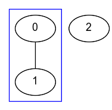

Given the [adjacency matrix](keyword://adjacency-matrix-unweighted) of an _undirected_ graph with _no loops or multiple edges_, find the size of the [connected component](keyword://connected-component) of vertex `1` (0-based).

**Example**

*   For

    ```
    matrix = [[false, true, false],
              [true, false, false],
              [false, false, false]]

    ```

    the output should be
    `bfsComponentSize(matrix) = 2`.

    The component contains vertices `0` and `1`.

    

*   For

    ```
    matrix = [[false, false, true, false],
              [false, false, false, false],
              [true, false, false, true],
              [false, false, true, false]]

    ```

    the output should be
    `bfsComponentSize(matrix) = 1`.

    The component consists of a single vertex `1`.

    

**Input/Output**

*   **[time limit] 4000ms (js)**

*   **[input] array.array.boolean matrix**

    _Adjacency matrix_ of the given graph.

    _Guaranteed constraints:_
    `3 ≤ matrix.length ≤ 10`,
    `matrix[i].length = matrix.length`.

*   **[output] integer**