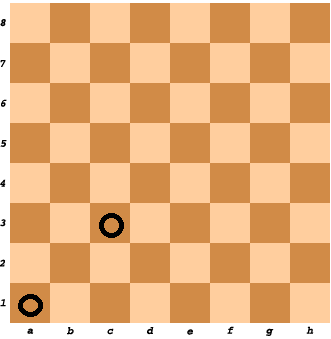

# chessBoardCellColor
Given two cells on the standard chess board, determine whether they have the same color or not.

**Example**

*   For `cell1 = "A1"` and `cell2 = "C3"`, the output should be
    `chessBoardCellColor(cell1, cell2) = true`.

    

*   For `cell1 = "A1"` and `cell2 = "H3"`, the output should be
    `chessBoardCellColor(cell1, cell2) = false`.

    

**Input/Output**

*   **[time limit] 4000ms (js)**

*   **[input] string cell1**

*   **[input] string cell2**

*   **[output] boolean**

    `true` if both cells have the same color, `false` otherwise.


## My Solution
```javascript
function chessBoardCellColor(cell1, cell2) {
​
  var getX = function(pos) {
    return pos.charCodeAt() - 'A'.charCodeAt();
  }
  var getY = function(pos) {
    return pos.charCodeAt() - '1'.charCodeAt();
  }
​
  var sum1 = getX(cell1[0]) + getY(cell1[1]);
  var sum2 =  getX(cell2[0]) + getY(cell2[1]) ;
  if (sum1 % 2 === sum2 % 2) {
    return true;
  }
  return false;
​
}
​
```
