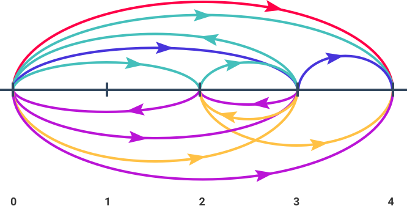

# countWaysToReachFinish
Consider a sequence of cells which are either free or blocked. The distance between each pair of consecutive cells is `1`. Initially you are standing in the first cell (1-based), you may visit only free cells, and your goal is to reach the last cell (both the first and the last cells are free). You move between cells only by jumping. You can make jumps of any integer length and in either direction with only two restrictions: you cannot make two jumps of equal length and you cannot jump out of the cell sequence.

Given a cell sequence, count the number of such sequences of jumps that after following them you will end up at the last cell. Two sequences of jumps are considered different either if they consist of different number of jumps or if for some `i`, the `i<sup>th</sup>` jumps of these two sequences differ.

**Example**

For `cells = [true, false, true, true, true]`, the output should be
`countWaysToReachFinish(cells) = 5`.

The following sequences of jumps are possible:

*   `+ 2 + 1 - 3 + 4`;
*   `+ 3 - 1 - 2 + 4`;
*   `+ 3 + 1`;
*   `+ 3 - 1 + 2`;
*   `+ 4`.

Here `+ x` means _"jump `x` cells to the right"_ and `- x` means _"jump `x` cells to the left"_. Check out the image below for better understanding:



**Input/Output**

*   **[time limit] 4000ms (js)**

*   **[input] array.boolean cells**

    If `cells[i] = true` then the respective cell is free. Otherwise it is blocked.

    _Guaranteed constraints:_
    `1 ≤ cells.length ≤ 12`.

*   **[output] integer**


## My Solution
```javascript
function countWaysToReachFinish(cells) {
​
  var n = cells.length;
  var MAX_MASK = 1 << n;
​
  // dp[m][k] - the number of ways to reach the k-th cell using jumps
  // that are marked in the mask m.
  var dp = [];
  var was = [];
  for (var m = 0; m < MAX_MASK; m++) {
    dp.push([]);
    was.push([]);
    for (var k = 0; k < n; k++) {
      dp[m].push(0);
      was[m].push(false);
    }
  }
  dp[0][0] = 1;
  was[0][0] = true;
​
  var get = function(m, k) {
    if (k < 0 || k >= n || !cells[k]) {
      return 0;
    }
    if (was[m][k]) {
```
