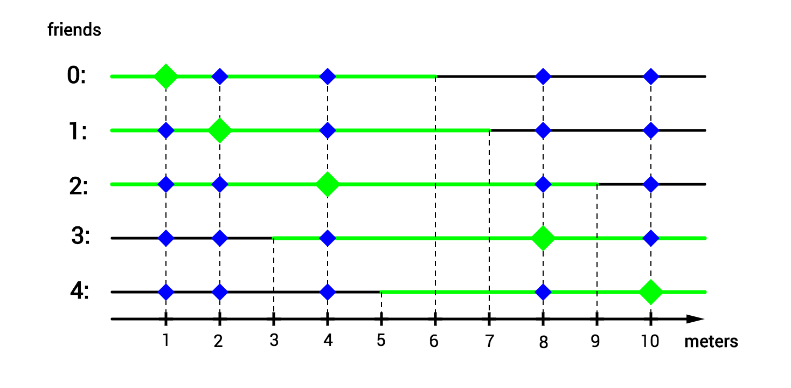

Several friends live along a straight street. They are friends, thus they enjoy visiting each other. However, they are lazy so none of them wants to visit a friend living more than `maxDist` meters away from them.

Given array `houses` representing coordinates of points where the friends live (in meters) and an integer `maxDist`, return an array representing the number of friends each person would be willing to visit.

**Example**

For `houses = [1, 2, 4, 8, 10]` and `maxDist = 5`, the output should be
`lazyFriends(houses, maxDist) = [2, 2, 3, 2, 1]`.

Check out the image below for better understanding:

**Input/Output**

*   **[time limit] 4000ms (js)**

*   **[input] array.integer houses**

    Sorted non-empty array of distinct integers.

    _Guaranteed constraints:_
    `1 ≤ houses.length ≤ 104`,
    `-104 ≤ houses[i] ≤ 104`.

*   **[input] integer maxDist**

    _Guaranteed constraints:_
    `2 ≤ maxDist ≤ 105`.

*   **[output] array.integer**