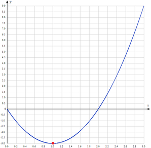

In the Mathland State University one of the mandatory tasks is to find the minimum of some polynomial function in the given interval, inclusive. Since nobody could cope with this task for ages, the teachers have decided to simplify the task and give their students only such functions that have minimum at the points with integer coordinates.
Student Joe doesn't know math good enough, but he is a programmer and he believes in the power of Programming. Joe made a bet with his teacher on writing a program that finds the answer faster than any student.

Given a polynomial, find its minimum in the given `interval`. It is guaranteed that the answer is an integer value.

**Example**

For `coeffs = [3, -6, 0]` and `interval = [0, 3]`, the output should be
`polynomialMinimum(coeffs, interval) = -3`.

The given polynomial is `3 * x2 - 6 * x + 0` (see the picture below for its plot).

**Input/Output**

*   **[time limit] 4000ms (js)**

*   **[input] array.integer coeffs**

    A polynomial is represented as an array of its coefficients and equals
    `coeffs[0] * xn - 1 + coeffs[1] * xn - 2 + ...`,
    where `n = coeffs.length`.

    _Guaranteed constraints:_
    `2 ≤ coeffs.length ≤ 10`,
    `-107 ≤ coeffs[i] ≤ 107`.

*   **[input] array.integer interval**

    An array of length `2`, where the second element is strictly greater then the first.
    It is guaranteed that in the given interval the function represented by `coeffs` has exactly one minimum, and strictly decreases before it and strictly increases after.

    _Guaranteed constraints:_
    `-5 · 108 ≤ interval[i] ≤ 5 · 108`.

*   **[output] integer**

    The minimum of the function in the given interval. It is guaranteed that the minimum is always an integer, and its coordinates are integers too.