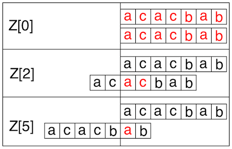

# zFunctionNaive
Return the value of [Z-function](keyword://z-function) for a given string.

**Example**

For `s = "acacbab"`, the output should be
`zFunctionNaive(s) = [7, 0, 2, 0, 0, 1, 0]`.

Here's where the non-zero values of _Z-function_ came from:


**Input/Output**

*   **[time limit] 4000ms (js)**

*   **[input] string s**

    A string of lowercase Latin letters.

    _Guaranteed constraints:_
    `3 ≤ s.length ≤ 10`.

*   **[output] array.integer**

    The value of _Z-function_ for `s`.


## My Solution
```javascript
function zFunctionNaive(s) {
    var arr = s.split("");
    var res = [];
    for (var i = 0; i < s.length; i++) {
        var count = 0;
        for (var j = 0; j < arr.length; j++) {
            if (s.charAt(j) == arr[j]) {
                count++;
            } else {
                break;
            }
        }
        res.push(count);
        arr.splice(0, 1);
    }
    return res;
}
​
```
