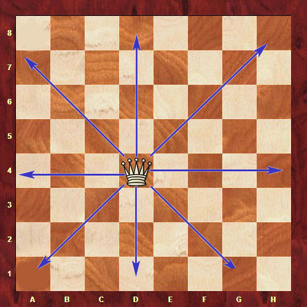

# chessQueen
In chess, queens can move any number of squares vertically, horizontally, or diagonally. Find all the possible coordinates on an `8 × 8` chessboard that would be safe from the attack of a queen positioned at coordinate `q`. Return the coordinates sorted in [lexicographical order](keyword://lexicographical-order-for-strings).

_Note: The coordinates should be given in the standard chess form: `a1`, `a2` ... `h8`._

**Example**

For `q = "d4"`, the output should be

```
chessQueen(q) =
["a2", "a3", "a5", "a6", "a8",
 "b1", "b3", "b5", "b7", "b8",
 "c1", "c2", "c6", "c7", "c8",
 "e1", "e2", "e6", "e7", "e8",
 "f1", "f3", "f5", "f7", "f8",
 "g2", "g3", "g5", "g6", "g8",
 "h1", "h2", "h3", "h5", "h6", "h7"]

```

Here is a visualization of the answer:


**Input/Output**

*   **[time limit] 4000ms (js)**

*   **[input] string q**

    A coordinate that indicates where the queen is positioned on the chessboard.

    _Guaranteed constraints:_
    `'a' ≤ q[0] ≤ 'h'`,
    `1 ≤ q[1] ≤ 8`.

*   **[output] array.string**

    An array that contains the coordinates of all the positions on the chessboard that the queen would not be able to attack.


## My Solution
```javascript
function chessQueen(q) {
    var coordToXY = function(boardCoordinate) {
        return [
            boardCoordinate.charCodeAt(0),
            boardCoordinate.charCodeAt(1)
        ];
    };
    var xyToCoord = function(xyCoordinate) {
        return String.fromCharCode(xyCoordinate[0]) + 
            String.fromCharCode(xyCoordinate[1]);
    };
    var pos = coordToXY(q);
    var res = [];
    for (var x = 97; x <= 104; x++) {
        for (var y = 49; y <= 56; y++) {
            var slope = (y - pos[1]) / (x - pos[0]);
            if (
                !isNaN(slope) &&
                isFinite(slope) &&
                Math.abs(slope) != 1 &&
                slope != 0
            ) {
                res.push(xyToCoord([x, y]));
            }
        }
    }
    return res;
}
```
